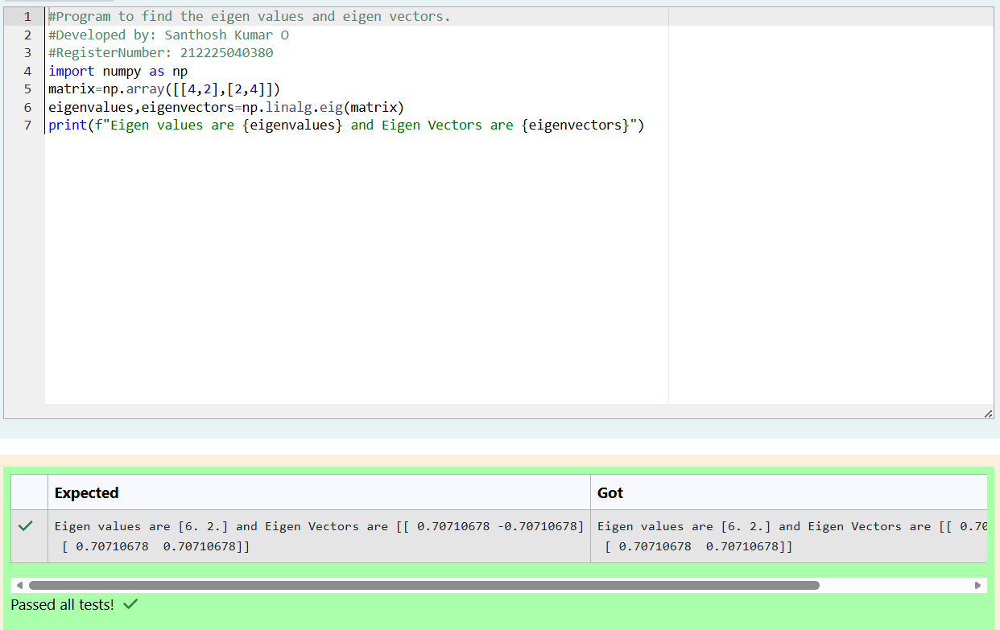

# EIGENVALUES-AND-EIGENVECTORS
## Aim:
To write a python program to find the Eigenvalues and Eigen Vectors
## Equipment’s required:
1. 	Hardware – PCs
2. 	Anaconda – Python 3.7 Installation / Moodle-Code Runner
## Algorithm:
### Step1 :  Import the numpy module to use the built-in functions for calculation.
### Step 2: Prepare the lists from each linear equations and assign in np.array().
### Step 3: Using the np.linalg.eig(),  we get two results (first is eigenvalue and second is eigenvector) of the given matrix.
### Step 4: Print the Eigen values and Eigen vectors inside the string using .format() function.

## Program:
```
#Program to find the eigen values and eigen vectors.
#Developed by: Santhosh Kumar O
#RegisterNumber: 212225040380
import numpy as np
matrix=np.array([[4,2],[2,4]])
eigenvalues,eigenvectors=np.linalg.eig(matrix)
print(f"Eigen values are {eigenvalues} and Eigen Vectors are {eigenvectors}")
```
## Output:

## Result:
Thus the Eigenvalue and Eigenvector is successfully solved using python program
